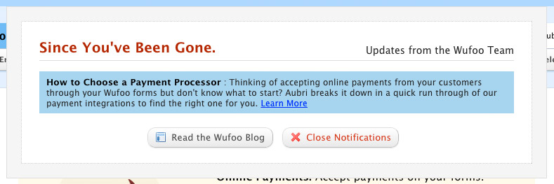

# Wufoo Blog Updates

April 18, 2014

<figure class="fit">
	
	<figcaption>
		Popup box on Wufoo start page
	</figcaption>
</figure>

I really like how Wufoo shows you a list of posts from their blog since your last log in. “Since You’ve Been Gone” is a simple div that pops up on the start page with a list of short summaries and links to the full entries.
